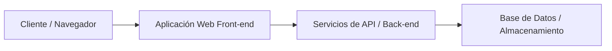

# Simple Web Application

A minimal [Python Flask](https://flask.palletsprojects.com/) web application used as the demo app in the [KodeKloud Docker for Beginners](https://kodekloud.com/courses/docker-for-the-absolute-beginner-hands-on/) course.

The app exposes two routes:

| Route | Response |
|---|---|
| `/` | `Welcome!` |
| `/how-are-you` | `I am good, how about you?` |

## Run manually (without Docker)

These steps assume a fresh machine.

1. Select an OS - Ubuntu

2. Update the package index:

   ```bash
   sudo apt-get update
   ```

3. Install Flask (this also pulls in Python 3):

   ```bash
   sudo apt-get install -y python3-flask
   ```

4. Set the Flask app environment variable:

   ```bash
   export FLASK_APP=app.py
   ```

5. Start the application:

   ```bash
   flask run --host=0.0.0.0
   ```

Then open `http://localhost:5000` and `http://localhost:5000/how-are-you` in a browser.

## Run with Docker

```bash
git clone https://github.com/mmumshad/simple-webapp-flask.git
cd simple-webapp-flask
docker build -t simple-webapp-flask .
docker run -p 5000:5000 simple-webapp-flask
```

Then open `http://localhost:5000` and `http://localhost:5000/how-are-you` in a browser.

## The Dockerfile

```dockerfile
FROM ubuntu

RUN apt-get update
RUN apt-get install -y python3-flask

COPY app.py /opt/app.py

ENV FLASK_APP=/opt/app.py

ENTRYPOINT ["flask", "run", "--host=0.0.0.0"]
```

Each instruction mirrors one of the manual steps above — making it easy to see how a Dockerfile is just an automated install script.

# Student Contribution

## Developer Information
- Name: Karen Anahi Padrón Martínez
- University: Universidad Tecnológica del Norte de Guanajuato (UTNG)
- Date: Junio 2026

## Proposed Improvements
1. Estructuración y claridad en la documentación del entorno local.
2. Incorporación de requerimientos funcionales detallados.
3. Inclusión de un diagrama de arquitectura visual mediante Mermaid.

## Observations
El proyecto cuenta con una base sólida, pero carece de un desglose visual de sus componentes principales en el README, lo que dificulta el onboarding rápido.

# miga-co

> Documentación del Proyecto

---

## Project Strengths
1. Código modular y fácil de escalar.
2. Excelente manejo de componentes reutilizables.
3. Comunidad activa y mantenimiento constante.
4. Documentación inicial clara para despliegues rápidos.
5. Compatibilidad e integración con múltiples herramientas de backend.

---

## Improvement Opportunities

1. Falta de diagramas arquitectónicos explicativos.
2. Poca claridad en la configuración de variables de entorno para principiantes.
3. Ausencia de una guía rápida de solución de errores comunes (Troubleshooting).
4. Pruebas unitarias insuficientes en los ejemplos básicos.
5. El archivo README principal es demasiado extenso y podría segmentarse.

---

## Tecnologías Utilizadas

| Tecnología | Uso / Función | Categoría |
| :--- | :--- | :--- |
| React  | Interfaz de usuario y ruteo | Frontend |
| TypeScript | Tipado seguro para evitar errores | Lenguaje |
| Node.js | Entorno de ejecución para servidor | Backend |
| GitHub Actions | Integración continua y pruebas | DevOps |


---

## Diagrama de Arquitectura


## 📋 Requerimientos Funcionales
 
| ID | Descripción |
| :--- | :--- |
| RF-01 | El sistema deberá permitir el registro de usuarios. |
| RF-02 | El sistema deberá permitir la autenticación de usuarios. |
| RF-03 | El sistema deberá permitir la recuperación de contraseña por correo electrónico. |
| RF-04 | El sistema deberá permitir la gestión de perfiles de usuario (editar nombre, foto y datos personales). |
| RF-05 | El sistema deberá permitir la creación, edición y eliminación de contenido por parte de usuarios autorizados. |
| RF-06 | El sistema deberá implementar un sistema de roles y permisos (administrador, editor, lector). |
| RF-07 | El sistema deberá permitir la búsqueda y filtrado de contenido por categoría, fecha y etiquetas. |
| RF-08 | El sistema deberá enviar notificaciones al usuario ante eventos relevantes (registro, cambios, alertas). |
| RF-09 | El sistema deberá registrar un historial de actividad por usuario. |
| RF-10 | El sistema deberá permitir la exportación de datos en formato CSV o JSON. |
| RF-11 | El sistema deberá garantizar el cierre de sesión automático tras un período de inactividad. |


## Team Members
- Brandon Gustavo Mendoza Amaro(Líder de Desarrollo)
- Karen Anahi Padrón Martínez 
- Lizeth Ramirez Ramirez
